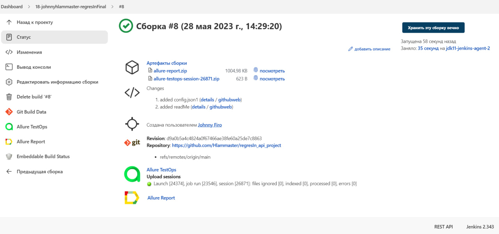
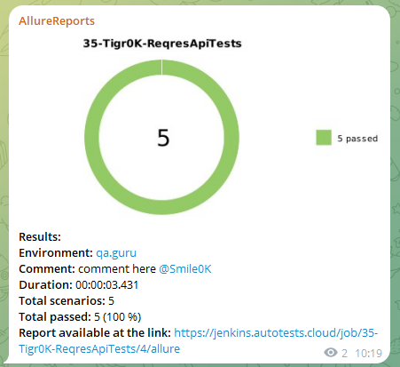
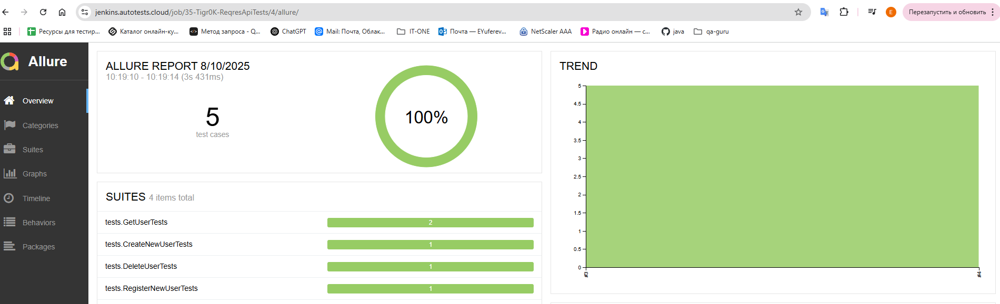

<h1 >Проект по автоматизации тестирования API для сайта <a href="https://reqres.in/">reqres.in</a></h1>


## :pushpin: Содержание:

* <a href="#tools">Технологии и инструменты</a>

* <a href="#cases">Реализованные проверки</a>

* <a href="#console">Запуск тестов из терминала</a>

* <a href="#jenkins">Запуск тестов в Jenkins</a>

* <a href="#telegram">Уведомления в Telegram</a>

* <a href="#allure">Allure Report отчеты</a>

* <a href="#allure-testops">Интеграция с Allure TestOps</a>

* <a href="#jira">Интеграция с Jira</a>


<a id="tools"></a>
## Технологии и инструменты
<p align="center">
<code><a href="https://www.jetbrains.com/idea/"></a></code>
<code><a href="https://www.java.com/"></a></code>
<code><a href="https://junit.org/junit5/"></a></code>
<code><a href="https://gradle.org/"></a></code>
<code><a href="https://github.com/"></a></code>
<code><a href="https://www.jenkins.io/"></a></code>
<code><a href="https://github.com/allure-framework/allure2"></a></code>
<code><a href="https://qameta.io/"></a></code>
<code><a href="https://web.telegram.org/"></a></code>
<code><a href="https://www.atlassian.com/software/jira"></a></code>
</p>

Автотесты написаны на `Java`.\
`Gradle` - сборщик проекта.  \
`JUnit5` - для выполнения тестов.\
`Jenkins` - CI/CD для запуска тестов удаленно.\
`Allure Report` - для визуализации результатов тестирования.\
`Telegram Bot` - для уведомлений о результатах тестирования.\
`Allure TestOps` - как система управления тестированием.

<a id="cases"></a>

## :heavy_check_mark: Примеры автоматизированных тест-кейсов
- :white_check_mark: Корзина
    - :heavy_check_mark: Получение одного пользователя позитивный
    - :heavy_check_mark: Получение одного пользователя пользователь не найден
    - :heavy_check_mark: Регистрация нового пользователя
    - :heavy_check_mark: Создание нового пользователя
    - :heavy_check_mark: Удаление пользователя
    
<a id="console"></a>
##  Запуск тестов из терминала
### Локальный запуск тестов

```
gradle clean test  
```

<a id="jenkins"></a>
## </a> Запуск тестов в [Jenkins](https://jenkins.autotests.cloud/job/35-Tigr0K-ReqresApiTests/)

<p align="center">

> Для запуска необходимо нажать "Собрать сейчас".

<https://jenkins.autotests.cloud/job/35-Tigr0K-ReqresApiTests/"></a>

> При клике на сборку после завершения можно увидеть артефакты запуска и полезные ссылки для более детального изучения прогона.

<a href="https://jenkins.autotests.cloud/job/AD_demo_api_reqres/"></a>
</p>

<a id="telegram"></a>
## </a> Уведомления в Telegram

<p >

> С помощью настроенного бота после завершения прогона в Jenkins поступают уведомления в Telegram.


</p>

<a id="allure"></a>
## </a> [Allure Report](https://jenkins.autotests.cloud/job/35-Tigr0K-ReqresApiTests/4/allure/) отчеты

### Основное окно

<p align="center">

</p>

### Отчеты по тестам

<p align="center">

> В отчете по тестам присутствует развернутая информация по запросам и ответам.


</p>

<a id="allure-testops"></a>
## </a> Интеграция с [Allure TestOps]()

### Основное окно

<p align="center">

</p>

### Тест кейсы

<p align="center">

</p>

<a id="jira"></a>
## </a> Интеграция с [Jira]()

<p align="center">

</p>

